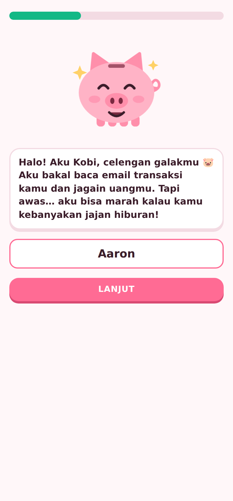
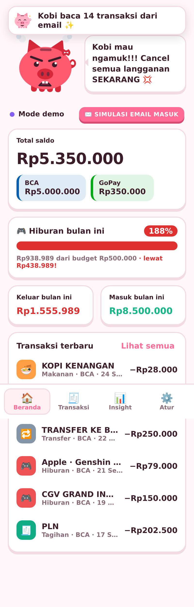

# 🐷 CashTracker

Track your spending **live from Gmail**: bank notifications (BCA, Mandiri, BNI, BRI, Jago…), receipts (Apple, Netflix, Spotify, Steam, Gojek, Grab, Tokopedia, Shopee, PLN…), auto-categorized. You get per-bank balances, monthly insights, and **Kobi**, a piggy bank (celengan) mascot who gets angrier the more you spend on **Hiburan**.

<p>
  
  
</p>

## How it works

1. **Onboarding**: enter your name, add each bank/e-wallet, and type its **current balance**. Then set a monthly Hiburan budget.
2. **Connect Gmail** (read-only). The app searches only for mail from known banks/merchants or receipt-like subjects, parses the amount/merchant, and **checks every 60 seconds** (configurable) while the tab is open.
3. **Balance per bank** = the balance you typed in − spending + income *after* that moment. Older emails still show up in insights but don't change the balance. You can reset a bank's balance any time in **Atur**.
4. **No double-counting**: an Apple/Netflix receipt and the matching BCA notification (same amount, within 3 days) are merged into one transaction. It keeps the bank from the notification and the name/category from the receipt.
5. **Categories**: Makanan, Transportasi, Belanja, Hiburan, Tagihan, Kesehatan, Transfer, Pemasukan, Lainnya. Categories are keyword-based. If you fix one by hand, you can tell it to "always categorize this merchant as X".
6. **Kobi's moods**, based on Hiburan vs. budget this month:

   | Hiburan / budget | Kobi |
   |---|---|
   | < 50% | 😊 happy (sparkles, bouncing) |
   | 50–80% | 😌 chill |
   | 80–100% (or Hiburan ≥ 50% of all spending) | 😰 worried (sweating) |
   | 100–150% | 😠 angry (steam, shaking) |
   | ≥ 150% | 🔥 furious (red, teeth, shaking hard) |

   Kobi also pops up a toast for every new transaction, and yells at you for Hiburan ones.
   **Tap Kobi** to cycle through 10 animations: jump, spin, wave, dance, love, dizzy, coin, flip, sleepy, laugh.
7. **Organized spending**: the Riwayat tab groups transactions by **email source** (BCA, Apple, Netflix, Gojek…), by category, or by date, sorted biggest-first or newest-first, per month.

**Privacy:** there's no backend. Email is fetched and parsed in your browser, and data is stored in `localStorage` on that device. The Gmail token lives only in memory.

## Run it

```bash
npm install
cp .env.example .env   # add your Google OAuth client ID (see below)
npm run dev            # http://localhost:5173
```

```bash
npm test          # parser / ledger / mood unit tests
npm run build     # typecheck + production build in dist/
```

## Deploy (Cloudflare Pages)

1. Cloudflare dashboard → **Workers & Pages → Create → Pages → Connect to Git** → pick `Aarongho/cashtracker`.
2. Framework preset: **None**. Build command: `npm run build`. Build output directory: `dist`.
3. Save and deploy. Every push to `main` redeploys to `https://<project>.pages.dev`.
4. Add that exact `https://<project>.pages.dev` origin to the OAuth client's **Authorized JavaScript origins** in Google Cloud.

## Google setup (for real Gmail)

1. In [Google Cloud Console](https://console.cloud.google.com/), create a project and enable the **Gmail API**.
2. **OAuth consent screen**: set it to External, add the scope `.../auth/gmail.readonly`, and add your own Gmail address under **Test users**.
3. **Credentials → Create OAuth client ID → Web application**. Add `http://localhost:5173` (and your deployed URL, if any) to **Authorized JavaScript origins**.
4. The hosted app has its client ID built in (`DEFAULT_CLIENT_ID` in `src/lib/gmail.ts`); for your own deployment, tap **Sambungkan Gmail → Pakai Google Client ID sendiri**, paste yours, and log in. It's saved in your browser. (Alternatively, bake it in at build time with `VITE_GOOGLE_CLIENT_ID` in `.env`, or as a repo secret for the GitHub Pages build.)

> `gmail.readonly` is a *restricted* scope. In **Testing** mode only the Gmail accounts listed under *Test users* can sign in (anyone else gets `Error 403: access_denied`). Switching the app to **In production** without verification lets anyone sign in after a "Google hasn't verified this app" warning, capped at 100 users. Going beyond that needs Google's verification and a security assessment.

The access token expires after about 1 hour, and browsers block silent re-login popups. When that happens the status bar shows **Sambungkan lagi**, and one tap reconnects.

## Project layout

```
src/
  lib/parsers.ts     sender detection, amount/merchant extraction, Gmail query
  lib/categorize.ts  keyword → category rules
  lib/ledger.ts      merge/dedupe, per-bank balances, monthly stats
  lib/mood.ts        Kobi's mood + lines
  lib/gmail.ts       Google Identity Services token + Gmail REST calls
  lib/demo.ts        sample emails used by the tests
  components/        Mascot (SVG Kobi), Onboarding, Home, Transactions, Insights, Settings
  useSync.ts         Gmail connection + live polling
  store.ts           reducer + localStorage persistence
```

## Adding a bank or merchant

Add an entry to `SOURCES` in `src/lib/parsers.ts` (sender regex, `bank` or `merchant`, optional default category), and add its domain to `gmailQuery`. Email formats change often, so if an email isn't picked up, paste its text into a test in `src/lib/parsers.test.ts` and adjust the patterns.
